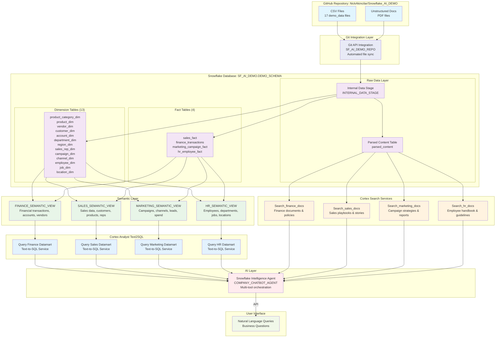

# Snowflake Intelligence Demo

This project demonstrates the comprehensive Snowflake Intelligence capabilities including:
- **Cortex Analyst** (Text-to-SQL via semantic views)
- **Cortex Search** (Vector search for unstructured documents)  
- **Snowflake Intelligence Agent** (Multi-tool AI agent with orchestration)
- **Git Integration** (Automated data loading from GitHub repository)

## Key Components

### 1. Data Infrastructure
- **Star Schema Design**: 13 dimension tables and 4 fact tables covering Finance, Sales, Marketing, HR
- **Automated Data Loading**: Git integration pulls data from GitHub repository
- **Realistic Sample Data**: 150,000+ records across all business domains
- **Database**: `SF_AI_DEMO` with schema `DEMO_SCHEMA`
- **Warehouse**: `Snow_Intelligence_demo_wh` (XSMALL with auto-suspend/resume)

### 2. Semantic Views (4 Business Domains)
- **Finance Semantic View**: Financial transactions, accounts, departments, vendors
- **Sales Semantic View**: Sales data, customers, products, regions, sales reps
- **Marketing Semantic View**: Campaign performance, channels, leads, impressions
- **HR Semantic View**: Employee data, departments, jobs, locations, attrition

### 3. Cortex Search Services (4 Domain-Specific)
- **Finance Documents**: Expense policies, financial reports, vendor contracts
- **HR Documents**: Employee handbook, performance guidelines, department overviews
- **Marketing Documents**: Campaign strategies, performance reports, marketing plans
- **Sales Documents**: Sales playbooks, customer success stories, performance data

### 4. Snowflake Intelligence Agent
- **Multi-Tool Agent**: Combines Cortex Search and Cortex Analyst capabilities
- **Cross-Domain Analysis**: Can query all business domains and documents
- **Natural Language Interface**: Responds to business questions across all departments
- **Visualization Support**: Generates charts and visualizations for data insights

### 5. GitHub Integration
- **Repository**: `https://github.com/NickAkincilar/Snowflake_AI_DEMO.git`
- **Automated Sync**: Pulls demo data and unstructured documents
- **File Processing**: Parses PDF documents using Cortex Parse for search indexing

## Architecture Diagram

The following diagram shows how all components work together in the Snowflake Intelligence Demo:



### Data Flow Explanation:
1. **Source Repository**: GitHub repository contains both CSV files (17 demo data files) and unstructured documents (PDF)
2. **Git Integration**: Git API Integration (SF_AI_DEMO_REPO) automatically syncs all files from GitHub to Snowflake's internal stage
3. **Structured Data**: CSV files populate 13 dimension tables and 4 fact tables in a star schema
4. **Unstructured Data**: PDF documents are parsed and stored in the `parsed_content` table
5. **Semantic Layer**: Business-specific semantic views provide natural language query capabilities over structured data
6. **Cortex Analyst Layer**: Each semantic view connects to a dedicated Text2SQL service for natural language to SQL conversion
7. **Search Services**: Domain-specific Cortex Search services enable vector search over unstructured documents
8. **AI Orchestration**: The Snowflake Intelligence Agent orchestrates between Text2SQL services and Search services
9. **User Access**: Users interact through API connections to the agent using natural language queries

## Database Schema

### Dimension Tables (13)
- `product_category_dim`, `product_dim`, `vendor_dim`, `customer_dim`
- `account_dim`, `department_dim`, `region_dim`, `sales_rep_dim`
- `campaign_dim`, `channel_dim`, `employee_dim`, `job_dim`, `location_dim`

### Fact Tables (4)
- `sales_fact` - Sales transactions with amounts and units
- `finance_transactions` - Financial transactions across departments
- `marketing_campaign_fact` - Campaign performance metrics
- `hr_employee_fact` - Employee data with salary and attrition

## Setup Instructions

**Single Script Setup**: The entire demo environment is created with one script:

1. **Run the complete setup script**:
   ```sql
   -- Execute in Snowflake worksheet
/sql_scripts/demo_setup.sql
   ```

2. **What the script creates**:
   - `SF_Intelligence_Demo` role and permissions
   - `Snow_Intelligence_demo_wh` warehouse
   - `SF_AI_DEMO.DEMO_SCHEMA` database and schema
   - Git repository integration
   - All dimension and fact tables with data
   - 4 semantic views for Cortex Analyst
   - 4 Cortex Search services for documents
   - 1 Snowflake Intelligence Agent

3. **Post-Setup Verification**:
   - Run `SHOW TABLES;` to verify 17 tables created
   - Run `SHOW SEMANTIC VIEWS;` to verify 4 semantic views
   - Run `SHOW CORTEX SEARCH SERVICES;` to verify 4 search services
   - Test agent: `SELECT SNOWFLAKE_INTELLIGENCE.AGENTS.COMPANY_CHATBOT_AGENT('What are our monthly sales for 2025?');`


## Agent Capabilities

The Company Chatbot Agent can:
- **Analyze structured data** across Finance, Sales, Marketing, and HR domains
- **Search unstructured documents** to provide context and policy information
- **Generate visualizations** including trend lines, bar charts, and analytics
- **Combine insights** from multiple data sources for comprehensive answers
- **Understand business context** and provide domain-specific insights 
