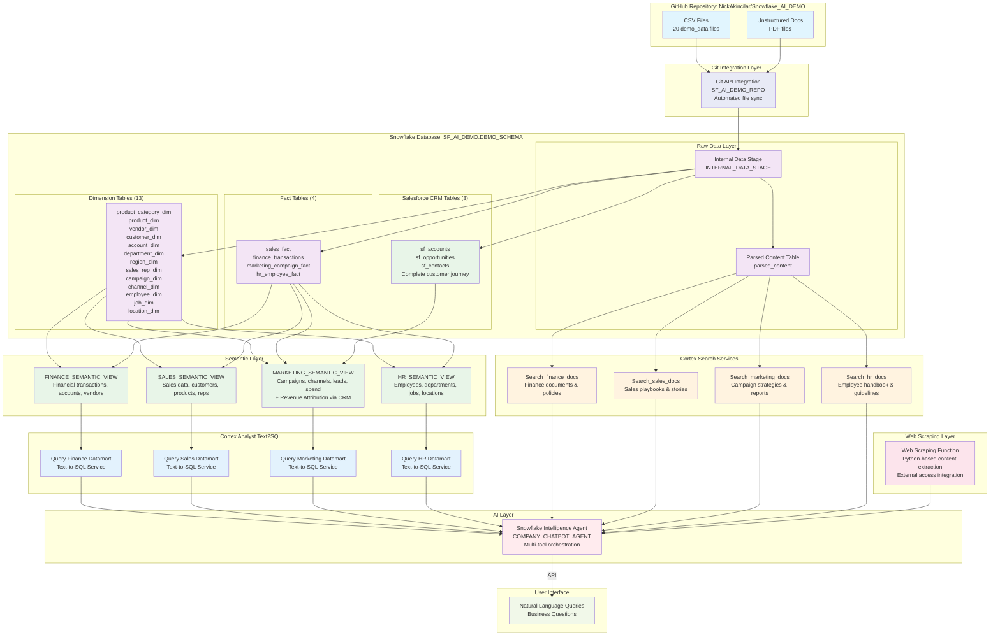

# Snowflake Intelligence Demo

This project demonstrates the comprehensive Snowflake Intelligence capabilities including:
- **Cortex Analyst** (Text-to-SQL via semantic views)
- **Cortex Search** (Vector search for unstructured documents)  
- **Snowflake Intelligence Agent** (Multi-tool AI agent with orchestration)
- **Git Integration** (Automated data loading from GitHub repository)

## Key Components

### 1. Data Infrastructure
- **Star Schema Design**: 13 dimension tables and 4 fact tables covering Finance, Sales, Marketing, HR
- **Salesforce CRM Integration**: 3 Salesforce tables (Accounts, Opportunities, Contacts) with 62,000+ CRM records
- **Automated Data Loading**: Git integration pulls data from GitHub repository
- **Realistic Sample Data**: 210,000+ records across all business domains with complete customer journey
- **Database**: `SF_AI_DEMO` with schema `DEMO_SCHEMA`
- **Warehouse**: `Snow_Intelligence_demo_wh` (XSMALL with auto-suspend/resume)

### 2. Semantic Views (4 Business Domains)
- **Finance Semantic View**: Financial transactions, accounts, departments, vendors
- **Sales Semantic View**: Sales data, customers, products, regions, sales reps
- **Marketing Semantic View**: Campaign performance, channels, leads, impressions + **Revenue Attribution** (Salesforce CRM integration)
- **HR Semantic View**: Employee data, departments, jobs, locations, attrition

### 3. Cortex Search Services (4 Domain-Specific)
- **Finance Documents**: Expense policies, financial reports, vendor contracts
- **HR Documents**: Employee handbook, performance guidelines, department overviews
- **Marketing Documents**: Campaign strategies, performance reports, marketing plans
- **Sales Documents**: Sales playbooks, customer success stories, performance data

### 4. Snowflake Intelligence Agent
- **Multi-Tool Agent**: Combines Cortex Search, Cortex Analyst, and Web Scraping capabilities
- **Cross-Domain Analysis**: Can query all business domains and documents
- **Web Content Analysis**: Can scrape and analyze content from any web URL
- **Natural Language Interface**: Responds to business questions across all departments
- **Visualization Support**: Generates charts and visualizations for data insights

### 5. GitHub Integration
- **Repository**: `https://github.com/NickAkincilar/Snowflake_AI_DEMO.git`
- **Automated Sync**: Pulls demo data and unstructured documents
- **File Processing**: Parses PDF documents using Cortex Parse for search indexing

## Architecture Diagram

The following diagram shows how all components work together in the Snowflake Intelligence Demo:



### Data Flow Explanation:
1. **Source Repository**: GitHub repository contains both CSV files (20 demo data files) and unstructured documents (PDF)
2. **Git Integration**: Git API Integration (SF_AI_DEMO_REPO) automatically syncs all files from GitHub to Snowflake's internal stage
3. **Structured Data**: CSV files populate 13 dimension tables and 4 fact tables in a star schema
4. **Salesforce CRM Data**: 3 additional Salesforce tables (sf_accounts, sf_opportunities, sf_contacts) provide complete customer journey tracking
5. **Unstructured Data**: PDF documents are parsed and stored in the `parsed_content` table
6. **Semantic Layer**: Business-specific semantic views provide natural language query capabilities over structured data
7. **Marketing Revenue Attribution**: Enhanced Marketing Semantic View connects campaign data to Salesforce CRM for end-to-end ROI analysis
8. **Cortex Analyst Layer**: Each semantic view connects to a dedicated Text2SQL service for natural language to SQL conversion
9. **Search Services**: Domain-specific Cortex Search services enable vector search over unstructured documents
10. **Web Scraping Service**: Custom Python function enables real-time analysis of external web content
11. **AI Orchestration**: The Snowflake Intelligence Agent orchestrates between Text2SQL services, Search services, and Web Scraping
12. **User Access**: Users interact through API connections to the agent using natural language queries

## Database Schema

### Dimension Tables (13)
- `product_category_dim`, `product_dim`, `vendor_dim`, `customer_dim`
- `account_dim`, `department_dim`, `region_dim`, `sales_rep_dim`
- `campaign_dim`, `channel_dim`, `employee_dim`, `job_dim`, `location_dim`

### Fact Tables (4)
- `sales_fact` - Sales transactions with amounts and units (12,000 records)
- `finance_transactions` - Financial transactions across departments
- `marketing_campaign_fact` - Campaign performance metrics with product targeting
- `hr_employee_fact` - Employee data with salary and attrition (5,640 records)

### Salesforce CRM Tables (3)
- `sf_accounts` - Customer accounts linked to customer_dim (1,000 records)
- `sf_opportunities` - Sales pipeline and revenue data (25,000 records)
- `sf_contacts` - Contact records with campaign attribution (37,563 records)

## Setup Instructions

**Single Script Setup**: The entire demo environment is created with one script:

1. **Run the complete setup script**:
   ```sql
   -- Execute in Snowflake worksheet
   /sql_scripts/demo_setup.sql
   ```

2. **What the script creates**:
   - `SF_Intelligence_Demo` role and permissions
   - `Snow_Intelligence_demo_wh` warehouse
   - `SF_AI_DEMO.DEMO_SCHEMA` database and schema
   - Git repository integration
   - All dimension and fact tables with data
   - 4 semantic views for Cortex Analyst
   - 4 Cortex Search services for documents
   - Web scraping function with external access integration
   - 1 Snowflake Intelligence Agent with multi-tool capabilities

3. **Post-Setup Verification(Optional)**:
   - Run `SHOW TABLES;` to verify 20 tables created (17 original + 3 Salesforce CRM)
   - Run `SHOW SEMANTIC VIEWS;` to verify 4 semantic views
   - Run `SHOW CORTEX SEARCH SERVICES;` to verify 4 search services
   - Run `SHOW FUNCTIONS LIKE 'WEB_SCRAPE';` to verify web scraping function
4. **RUN DEMO**:
   - Use AI/ML option on the left navigation bar
   - Pick "Snowflake Intelligence"
   - Make sure to pick the right agent at the bottom-left 


## Agent Capabilities

The Company Chatbot Agent can:
- **Analyze structured data** across Finance, Sales, Marketing, and HR domains
- **Perform revenue attribution** from marketing campaigns to closed deals via Salesforce CRM integration
- **Search unstructured documents** to provide context and policy information
- **Scrape and analyze web content** from any URL to incorporate external data and insights
- **Generate visualizations** including trend lines, bar charts, and analytics
- **Combine insights** from multiple data sources for comprehensive answers
- **Calculate marketing ROI** and customer acquisition costs across the complete customer journey
- **Understand business context** and provide domain-specific insights

## Demo Script: Cross-Functional Business Analysis

The following questions demonstrate the agent's ability to perform cross-domain analysis, connecting insights across Sales, HR, Marketing, and Finance:

### 🎯 Sales Performance Analysis
1. **Sales Trends & Performance**  
   "Show me monthly sales trends for 2025 with visualizations. Which months had the highest revenue?"

2. **Top Products & Revenue Drivers**  
   "What are our top 5 products by revenue in 2025? Show me their performance by region."

3. **Sales Rep Performance**  
   "Who are our top performing sales representatives? Show their individual revenue contributions and deal counts."

### 👥 HR & Workforce Analysis
1. **Sales Rep Tenure & Performance Correlation**  
   "What is the average tenure of our top sales reps? Is there a correlation between tenure and sales performance?"

2. **Department Staffing & Costs**  
   "Show me employee headcount and average salary by department. Which departments have the highest attrition rates?"

3. **Workforce Distribution & Performance**  
   "How are our employees distributed across locations? What are the performance differences by location?"

### 📈 Marketing Campaign Effectiveness & Revenue Attribution
1. **Campaign ROI & Revenue Generation**  
   "Which marketing campaigns generated the most revenue in 2025? Show me marketing ROI and cost per lead by channel."

2. **Complete Funnel Analysis**  
   "Show me the complete marketing funnel from impressions to closed revenue. Which campaigns have the best conversion rates?"

3. **Channel Revenue Performance**  
   "Compare marketing spend to actual closed revenue by channel. Which channels drive the highest value customers?"

### 💰 Finance & Cross-Domain Integration
1. **Marketing Attribution & Revenue Analysis**  
   "Show me revenue generated by each marketing channel. What is our true marketing ROI from campaigns to closed deals?"

2. **Customer Acquisition Cost Analysis**  
   "Calculate our customer acquisition cost by marketing channel. Which channels deliver the most profitable customers?"

3. **Vendor Spend & Policy Compliance**  
   "What are our top vendor expenses? Check our vendor management policy - are we following procurement guidelines?"

### 🔍 Cross-Functional Insights & External Data
**Web Content Analysis Questions**  
1. **Competitive Intelligence**  
   "Analyze the content from [competitor website URL] and compare their product offerings to our product catalog."

2. **Market Research**  
   "Scrape content from [industry report URL] and analyze how it relates to our sales performance and market positioning."

3. **External Data Integration**  
   "Get the latest information from [company news URL] and analyze its potential impact on our sales forecast."

**Ultimate Cross-Domain Question**  
"Create a comprehensive business dashboard showing: sales performance by top reps, their tenure and compensation, marketing campaigns that generated their leads, the complete customer journey from campaign to closed deal, and the ROI of each marketing channel. Include any relevant policy information from our documents and external market data from [industry URL]."

### 📋 Demo Flow Recommendation
1. **Start with Sales**: Establish baseline performance metrics and customer data
2. **Connect to HR**: Link performance to workforce characteristics  
3. **Add Marketing Context**: Show how campaigns generate leads and drive sales results
4. **Revenue Attribution**: Demonstrate complete customer journey from campaign to closed revenue
5. **Financial Integration**: Calculate true marketing ROI and customer acquisition costs
6. **External Data Analysis**: Use web scraping to incorporate competitor or market data
7. **Cross-Domain Synthesis**: Combine all insights including external data for strategic decision-making

This progression showcases how the Snowflake Intelligence Agent seamlessly connects structured data analysis with Salesforce CRM integration, unstructured document insights, and real-time web content analysis across all business domains for complete revenue attribution and competitive intelligence. 
